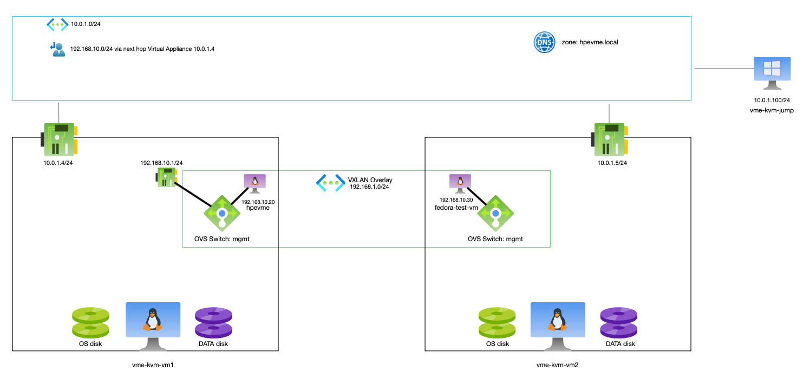

# Getting Started: Complete Deployment Guide

This guide walks you through deploying and configuring the complete KVM virtualization environment on Azure, from initial setup to verification.

## Overview


This deployment creates:
- 2 Ubuntu KVM hosts with nested virtualization support.
- 1 Windows Server 2022 jumphost for remote access.
- A private DNS zone for internal name resolution.
- A VXLAN-based overlay network for seamless communication between nested VMs.
- A complete Azure networking infrastructure, including a VNet, subnet, and Network Security Groups (NSGs).

A diagram of the infrastructure being deployed is shown in the following image.



> **NOTE** that the code in this repo does not create the hpevme vm on the diagram. That is currently a manual action is done by running the `hpe-vm` command on the first host, which also has the compressed qcow2 image for the vm in the `/tmp` directory. 

**Estimated Time**: 30-45 minutes

## Prerequisites

### 1. Required Tools / Software

- **Azure CLI**: [Installation Guide](https://docs.microsoft.com/en-us/cli/azure/install-azure-cli)
- **Ansible**: [Installation Guide](https://docs.ansible.com/ansible/latest/installation_guide/intro_installation.html)
- **Terraform**: [Installation Guide](https://learn.hashicorp.com/tutorials/terraform/install-cli)
OR
- **OpenTofu**: [Installation Guide](https://opentofu.org/docs/intro/install/)
- **HPE VM Essentials**: [Installation Guide](https://support.hpe.com/hpesc/public/docDisplay?docId=sd00006775en_us&page=GUID-B96D6475-9834-4E0F-A08B-CB97F532B786.html) You will need to download the `HPE_VM_Essentials_SW_image_vX.X.XX_NNNNN-ZZZZZ.iso` ISO and extract the following files from it and store them in the root of this repo:
  - [ ] `hpe-vm-essentials-X.X.XX-x.qcow2.gz`
  - [ ] `hpe-vm_X.X.XX-x_amd64.deb`

    Replacing X with the correct version number

> **NOTE** when using OpenToFu, use the `tofu` command rather than the `terraform` command!

### 2. Azure Authentication

Log in to your Azure account:
```bash
az login
```

### 3. SSH Key

Ensure you have an SSH key pair. If not, generate one:
```bash
ssh-keygen -t rsa -b 4096 -f ~/.ssh/id_rsa
```

### 4. Your Public IP

You will need your public IP address to restrict access to the VMs:
```bash
curl -s https://api.ipify.org
```

## Step 1: Configure Terraform

1.  **Copy the example variables file**:
    ```bash
    cp terraform.tfvars.example terraform.tfvars
    ```

2.  **Edit `terraform.tfvars`** and update the following values:
    -   `ssh_public_key_path`: The path to your SSH public key (e.g., `~/.ssh/id_rsa.pub`).
    -   `my_public_ip`: Your public IP address from the previous step (e.g., `"203.0.113.45/32"`).

3.  **Prepare a password** for the Windows jumphost. It must meet Azure's complexity requirements.

## Step 2: Deploy with Terraform

1.  **Initialize Terraform**:
    ```bash
    terraform init
    ```

2.  **Plan and Apply**:
    ```bash
    terraform apply
    ```
    You will be prompted for the Windows jumphost password. Review the plan and type `yes` to approve.

3.  **Save the output**:
    ```bash
    terraform output -json > deployment-info.json
    ```

## Step 3: Configure with Ansible

1.  **Update the Ansible inventory** (`inventory.yml`) with the public IPs from the Terraform output:
    ```bash
    # Get the public IPs
    terraform output vm_public_ips
    terraform output jumphost_public_ip
    ```

2.  **Configure Ansible Vault** to securely store the Windows jumphost password. See the [Ansible Vault documentation](https://docs.ansible.com/ansible/latest/user_guide/vault.html) for more information.

3. **Ensure correct ansible collections** are installed to be able to run all the playbooks
   ```
    ansible-galaxy collection install -r requirements.yml
   ```

4. **Confirm SSH** is working correctly
   - Ensure that you can log in with the account you specified for the Ubuntu hosts (`admin_username`) and using the SSH Keys (`ssh_public_key_path`) you specified in the `terraform.tfvars` file and ensure you allow/trust the SSH Key when prompted.

5.  **Run the main playbook** to configure the KVM hosts:
    ```bash
    ansible-playbook playbook-install-kvm.yml
    ```
    This playbook will install KVM, Open vSwitch, and configure the VXLAN overlay network using `netplan`.

6. **Run the `playbook-setup-consistent-disk-naming.yml` playbook** to configure consist disk name for the extra data disk and mounted as `/data`:
   ```bash
   ansible-playbook playbook-setup-consistent-disk-naming.yml
   ```

7. **Run the `playbook-configure-nfs.yml` playbook** to configure NFS Server on each host and create and export the `/data/VMs` directory which can then be used as shared storage for the cluster:
   ```bash
   ansible-playbook playbook-configure-nfs.yml
   ```

8.  **Run the Windows Playbook** to install putty (optional)
   ```bash
   ansible-playbook playbook-install-putty.yml
   ```

## Step 4: Install the HPE Essentials Manager

1. **Run hpe-vm** on the first host to deploy the HPE Essentials Manager:
   - SSH into the first host and run the following command:
   ```
   sudo hpe-vm
   ```
    > NOTE: The  `/tmp/hpe-vm-essentials-8.0.10-1.qcow2.gz` file must be present on the first host (the `playbook-install-kvm.yml` playbook would have placed this file in /tmp)

   - Check the diagram for the IP address to use for the Essentials Manager and use the Azure default DNS (`168.63.129.16`). Instead of the IP address, you may also use the following FQDN:
     `hpevme.hpevme.local`

2. **Run the switch-network-mode.sh script** to switch to overlay mode:
   - Run the following command on the first host to switch to full VXLAN Overlay mode:
     ```
     switch-network-mode.sh full
     ```

3. **Change the MTU size of the VME Manager** to 1450 to ensure that it is compatible with the overlay network:
   - Log into the `hpevme` vm on Host 1 using the following command (you will use the admin user/password you set in step 1):
     ```
     virsh console hpevme
     ```
   - Edit the netplan config which is located in /etc/netplan/50-cloud-init.yaml and add the `mtu: 1450` key/value under `eth0 > addresses` using vi.
     The netplan will look like this after editing:
     ```
     network:
       version: 2
       ethernets:
         eth0:
           match:
             macaddress: "52:54:00:70:8b:8d"
           addresses:
           - "192.168.10.20/24"
           mtu: 1450
           nameservers:
             addresses:
             - 168.63.129.16
           set-name: "eth0"
           routes:
             - to: "default"
               via: "192.168.10.1"
     ```
   - Now apply the netplan config:
     ```
     sudo netplan apply
     ```

## Step 5: Verify the Deployment

1.  **Verify the overlay network**:
    ```bash
    ansible-playbook playbook-verify-overlay.yml
    ```
    This playbook will run a series of checks to ensure the VXLAN tunnel and OVS bridge are configured correctly.

2.  **Deploy a test VM**:
    ```bash
    ansible-playbook playbook-deploy-test-vm.yml
    ```
    This will deploy a Fedora CoreOS VM on `vme-kvm-vm2`.

3.  **Test connectivity** from the test VM. You can log in to the test VM via the `virsh console` on `vme-kvm-vm2`.
    1.  Ensure you set the MTU on the Ethernet interface to `1450` using `sudo ip link set dev [device name] mtu 1450`. This is required for anything than generates more traffic than ping to correctly operate on the overlay network.

## Next Steps

-   Read the [README.md](README.md) for a detailed architecture overview.
-   Consult the other Markdown documents for deep dives into specific topics like networking and routing.